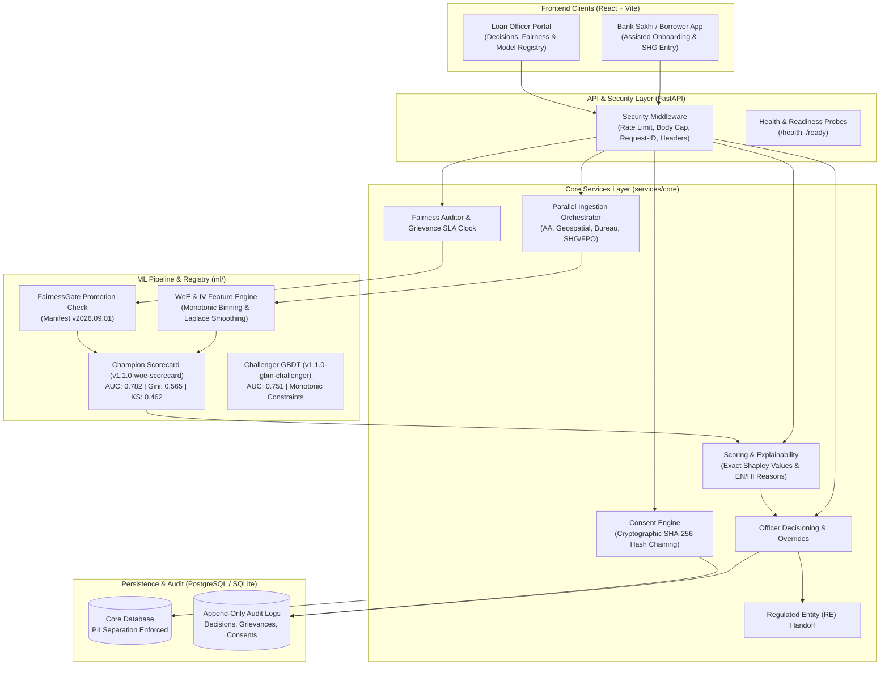

# CreditTech — Alternative Credit Scoring for Rural India

CreditTech is an AI-driven digital lending decision-support system serving farmers, SHGs, and rural micro-enterprises. It aggregates multi-source alternative data (Account Aggregator, satellite imagery, SHG records, and bureau history) using a modular monolith API built with FastAPI and PostgreSQL, generates SHAP-based reason codes for every score, enforces a fairness gate on model promotion, and ships a web frontend for both Bank Sakhi–assisted borrower onboarding and loan officer review.

> **Assignment scope:** ML / alternative-credit-finance system, not a production identity platform. Officer/borrower auth is header-based (demo). SSO/OIDC, mTLS, OAuth 2.0 client-credentials, and SMS/IVR were explicitly descoped. Android is descoped in favour of a web client.

---

## Status

- **Backend:** P0–P6 delivered — consent, ingestion (4 rails w/ graceful degradation), scoring, SHAP explainability, officer decisioning, RE handoff, fairness/grievance, institutional dashboard, DR, security middleware, Request-ID tracing, `/ready` probe, PDF report, fairness gate, model promotion pipeline, load harness.
- **Frontend:** React + Vite web apps under `apps/` — borrower / Sakhi entry app and loan officer dashboard with toast notifications, global error boundary, 404 handler, and accessible design.
- **Machine Learning:** Champion model `v1.1.0-woe-scorecard` (AUC: 0.7823, Gini: 0.5646, KS: 0.4623) & Challenger `v1.1.0-gbm-challenger` (AUC: 0.7506) with Spatial GroupKFold validation and WoE/IV transformation engine.
- **Tests:** 120 backend tests passing across all suites + P6 load harness (`tests/test_p6_load.py`).
- **Remaining before real pilot go-live:** external items only (see [`docs/phase7/pre_launch_gate.md`](docs/phase7/pre_launch_gate.md) — production credentials, signed vendor contracts, live borrower onboarding).

---

## System Architecture



---

## Technical Architecture (FastAPI + PostgreSQL)

- **FastAPI modular monolith** under `services/core/` — consent, ingestion, scoring, explainability, decisioning, handoff, grievance, monitoring, dashboard, admin, ops.
- **Append-only consent ledger** with cryptographic hash-chaining, plus **DB-level append-only triggers** (SQLite + Postgres DDL) on officer decision log, grievance audit log.
- **PII separation** enforced at the schema — Borrower PII columns (Aadhaar reference hash, encrypted name/phone) are never co-located with `FeatureSnapshot` rows.
- **Graceful ingestion** — `asyncio.gather` orchestrator with per-connector timeout; any single rail failing does not block scoring.
- **SHAP explainability** — exact Shapley contributions on the logistic scorecard; top-5 reason codes rendered in English + Hindi.
- **Fairness gate** — ratified manifest (`config/fairness_thresholds.json`) with `manifest_hash`; blocks model promotion on threshold breach.
- **Model promotion pipeline** — performance minimums (AUC ≥ 0.60, Gini ≥ 0.20, KS ≥ 0.15, Brier ≤ 0.30) plus fairness gate. `409` on block.
- **Request-ID correlation & observability** — `RequestIdMiddleware` injects `X-Request-ID` across structured logs; `/ready` probe tests live DB availability.
- **DR** — `sqlite3.Connection.backup()` for safe snapshots; parity-verified restore via `scripts/backup.py` and `scripts/restore.py`.
- **PDF report** — 3-tier fallback (WeasyPrint → ReportLab → hand-rolled minimal PDF) so `application/pdf` is guaranteed even without WeasyPrint installed.
- **Security middleware** — security headers, 1 MiB body cap, 240 req/min in-process rate limit.

---

## Phase Deliverables

### 📂 P0 — Regulatory & Operational Specifications
Consent record schema, preliminary feature list, RE handoff API contract, SHG/FPO UI spec, SHAP reason-code templates (EN/HI), AA FIU onboarding checklist, Bank Sakhi device assessment. All under `docs/phase0/`.

### 📂 P1 — Project Setup & Consent Foundation
FastAPI scaffolding (`services/core/`), containerized dev via `docker-compose.yml`, structured logging with PII scrubbing, SQLAlchemy ORM for all 10 core entities, Alembic migrations, hash-chained consent lifecycle (create / verify / revoke / audit).

### 📂 P2 — Data Ingestion + Sakhi Entry UI
Four connectors — AA, geospatial, bureau, SHG/FPO — behind a parallel async orchestrator with graceful degradation. Mock server (`services/core/ingestion/mocks/`) for offline dev. Web-based Sakhi entry UI under `apps/borrower-app/` (Android app descoped by user; the web app replaces it — see `apps/borrower-app/package.json`).

### 📂 P3 — Logistic Scorecard + SHAP + Model Registry
5-Cs weighted logistic scorecard (`ml/training/scorecard.py`), exact Shapley explainer (`ml/evaluation/explain.py`), bilingual reason codes, versioned model registry (`ml/registry/`), calibration report.

### 📂 P4 — Loan Officer Decision Interface
FastAPI `/api/v1/decisions/` with mandatory override-reason logging on model dissent, structured RE handoff export built to the P0 spec. React officer + Sakhi UI unified under `apps/borrower-app/` (deviation from plan's Jinja2/HTMX — one Vite portal on :5173 covering officer dashboard and borrower/Sakhi flows).

### 📂 P5 — Fairness Monitor, Grievance, Institutional Dashboard
Weekly batch `FairnessAuditor` across gender / geography / landholding / officer override; grievance channel with SLA clock; portfolio metrics endpoint + CSV export for external auditor; HTML score report.

### 📂 P6 — Production Hardening (ML/finance-scoped)
Fairness gate + ratified manifest, model promotion service with perf + fairness gates, DB-level append-only triggers, PDF renderer with 3-tier fallback, integration smoke-test framework, DR backup/restore + parity, security middleware, **load test harness** (`tests/test_p6_load.py` — 60-request burst = 2× pilot-peak per plan §9 P6 DoD).

**Descoped by user (assignment is ML/finance-oriented, not a production identity system):** SSO/OIDC officer login, borrower JWT session tokens, RE OAuth 2.0 + mTLS + idempotency, SMS/IVR grievance intake. Documented in [`docs/phase6/production_hardening.md`](docs/phase6/production_hardening.md).

### 📂 P7 — Pre-Launch (external-only)
Production-credential smoke framework (`services/core/ops/smoke.py`) is built; running it requires real sandbox/production credentials. Pre-launch checklist + runbooks in `docs/phase7/`.

---

## Repository Layout

```
credittech/
├── apps/
│   └── borrower-app/          # React + Vite unified portal (officer + Sakhi + borrower flows)
├── services/
│   └── core/                  # FastAPI monolith
│       ├── admin/             # Fairness gate + promotion endpoints (P6)
│       ├── consent/           # Consent lifecycle + hash-chain
│       ├── dashboard/         # Institutional dashboard + PDF report
│       ├── decisioning/       # Officer decision + audit
│       ├── explainability/    # SHAP reason codes
│       ├── grievance/         # Appeal channel + SLA
│       ├── handoff/           # RE handoff export
│       ├── ingestion/         # AA / geospatial / bureau / SHG-FPO
│       ├── monitoring/        # Fairness auditor + governance
│       ├── ops/               # Smoke tests + DR (P6)
│       ├── scoring/           # Score generation + registry lookup
│       ├── shared/            # Models, logging, security middleware
│       └── simulation/        # Pilot simulator
├── ml/
│   ├── features/  training/  evaluation/  registry/
├── config/
│   └── fairness_thresholds.json    # Ratified manifest (v2026.09.01)
├── scripts/
│   ├── backup.py  restore.py  train_scorecard.py
├── tests/                     # 120 tests + load harness
├── docs/
│   ├── phase0/ … phase6/      # Phase docs
│   └── research/              # External benchmarks
├── infra/                     # Terraform modules (staging/production)
├── alembic/                   # Migrations
├── docker-compose.yml
├── CONTRIBUTING.md            # Developer & evaluator setup guide
└── Dockerfile
```

---

## API Endpoint Reference (selected)

| Endpoint | Method | Summary |
|----------|--------|---------|
| `/api/v1/consent/` | `POST` | Create a hash-chained consent record |
| `/api/v1/consent/{id}/verify` | `GET` | Verify consent (integrity + status) |
| `/api/v1/consent/{id}/revoke` | `POST` | Revoke an active consent |
| `/api/v1/ingest/shg-fpo` | `POST` | Upload Bank Sakhi manual entry |
| `/api/v1/ingest/trigger` | `POST` | Fan out to all 4 ingestion rails |
| `/api/v1/score/` | `POST` | Generate score + bilingual SHAP reasons |
| `/api/v1/score/{id}` | `GET` | Retrieve historical score |
| `/api/v1/decisions/` | `POST` | Officer decision with override reason |
| `/api/v1/handoff/{app_id}` | `POST` | Export decision to partner RE (P0 contract) |
| `/api/v1/grievances/` | `POST` | Open an appeal (borrower session) |
| `/api/v1/grievances/{id}` | `PATCH` | Officer moves grievance through SLA |
| `/api/v1/dashboard/portfolio` | `GET` | Aggregate portfolio metrics |
| `/api/v1/dashboard/fairness` | `GET` | Latest fairness audit rows |
| `/api/v1/dashboard/fairness/export.csv` | `GET` | Auditor CSV export |
| `/api/v1/report/score/{id}` | `GET` | HTML score report |
| `/api/v1/report/score/{id}/pdf` | `GET` | PDF score report (P6) |
| `/api/v1/admin/fairness/manifest` | `GET` | Ratified fairness manifest + hash |
| `/api/v1/admin/fairness/gate` | `GET` | Dry-run FairnessGate |
| `/api/v1/admin/models/{v}/promotion-check` | `GET` | Dry-run promotion gate |
| `/api/v1/admin/models/{v}/promote` | `POST` | Promote model (fairness + perf gated) |
| `/api/v1/ops/smoke/integrations` | `POST` | Smoke-test AA / geospatial / bureau |
| `/ready` | `GET` | Readiness probe (verifies DB connectivity) |
| `/health` | `GET` | Health check (includes `X-Request-ID` correlation) |

---

## How to Run Locally

See [`CONTRIBUTING.md`](CONTRIBUTING.md) for full development environment setup, coding guidelines, and verification procedures.

### 1. Backend — Python virtualenv
Python 3.10+ required.

```bash
python -m venv .venv
# Windows PowerShell:
.venv\Scripts\Activate.ps1
# macOS/Linux:
source .venv/bin/activate

pip install -e ".[dev,ml]"
```

### 2. Run the test suite (backend)

```bash
python -m pytest
# 120 tests + load harness
```

### 3. Docker Compose (Postgres + FastAPI live-reload)

```bash
cp .env.example .env
docker compose up --build
```

Then open:

- OpenAPI docs — <http://localhost:8000/docs>
- Health — <http://localhost:8000/health>

### 4. Unified frontend portal

```bash
cd apps/borrower-app
npm install
npm run dev
# → http://localhost:5173 · Overview · Applications · Fairness · Model Registry · Grievances
```

### 5. DR drill (local demo)

```bash
python -m scripts.backup   ./credittech.db   ./backups/snap.db
python -m scripts.restore  ./backups/snap.db ./credittech-restored.db
```

---

## Known Limitations & Carried Deferrals

Per user scoping for the ML/finance-oriented assignment:

- Officer auth is header-based (`X-Officer-Id`, `X-Officer-Role`) — production SSO/OIDC + RBAC deferred.
- Borrower auth is header-based (`X-Borrower-Id`) — no session tokens.
- RE handoff uses simple auth headers — production OAuth 2.0 + mTLS + idempotency deferred.
- Grievance intake is web/API only — SMS/IVR/Twilio webhook deferred.
- WeasyPrint isn't a hard dependency — built-in PDF fallback ships now; production install would upgrade fidelity.
- Postgres append-only triggers ship as DDL but are unit-tested against SQLite only.
- Fairness thresholds in `config/fairness_thresholds.json` are pilot defaults; production requires external-auditor ratification.
- Real AA / geospatial / bureau credentials are not present — smoke framework returns `BLOCKED` (not fabricated as `PASS`).
- **P7 items (production deploy, live pilot launch, real borrower onboarding, Bank Sakhi field training, 4-week stability gate) are external and remain outside code scope.**
